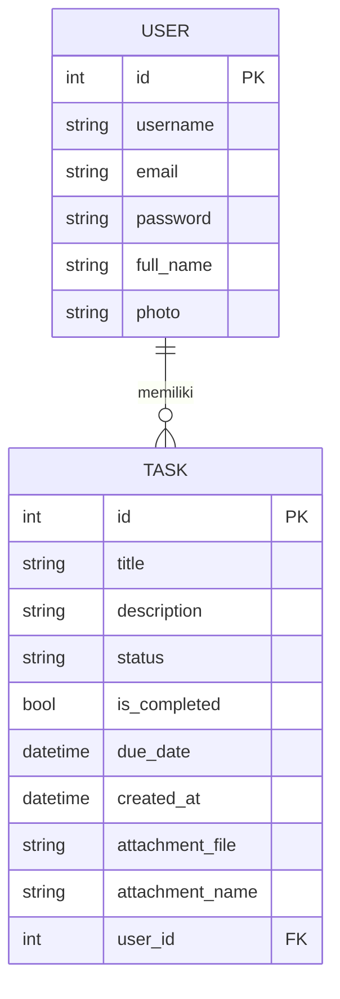

<div align="center">

# 🚀 ALFHA TASK
### Aplikasi Manajemen Tugas & Autentikasi Berbasis FastAPI

*Latihan Python Dasar — Belajar FastAPI, SQLAlchemy, dan Jinja2 lewat proyek nyata*


</div>

---

## 📑 Daftar Isi

- [Tentang Proyek](#-tentang-proyek)
- [Tampilan Aplikasi](#-tampilan-aplikasi)
- [Fitur Utama](#-fitur-utama)
- [Tumpukan Teknologi](#-tumpukan-teknologi)
- [Struktur Folder](#-struktur-folder)
- [Cara Menjalankan](#-cara-menjalankan)
- [Peta Endpoint (API/Routes)](#-peta-endpoint-apiroutes)
- [Skema Database](#-skema-database)
- [Alur Penggunaan](#-alur-penggunaan)
- [Checklist Belajar](#-checklist-belajar)
- [Catatan Keamanan](#-catatan-keamanan--penting-dibaca)
- [Rencana Pengembangan](#-rencana-pengembangan)
- [Lisensi](#-lisensi)

---

## 📖 Tentang Proyek

**ALFHA TASK** adalah aplikasi web sederhana untuk belajar membangun sistem **autentikasi**, **manajemen profil**, dan **manajemen tugas (to-do list)** menggunakan **FastAPI**. Proyek ini dibuat sebagai latihan Python dasar dengan pendekatan *"belajar sambil membangun"* — setiap file kode disertai komentar yang menjelaskan konsep di baliknya (ORM, dependency injection, routing, templating, dsb).

> 💡 **Cocok untuk kamu yang ingin belajar:** routing di FastAPI, ORM dengan SQLAlchemy, validasi data dengan Pydantic, rendering HTML dengan Jinja2, serta upload file.

---

## 🖼️ Tampilan Aplikasi

<details open>
<summary><b>🔐 Autentikasi (Login & Register)</b></summary>
<br>


</details>

<details>
<summary><b>👤 Manajemen Profil</b></summary>
<br>


</details>

<details>
<summary><b>✅ Dashboard Tugas</b></summary>
<br>


</details>

---

## ✨ Fitur Utama

<table>
<tr>
<td width="33%" valign="top">

### 🔐 Autentikasi
- Registrasi akun baru
- Login dengan username & password
- Logout
- Validasi username unik & email unik

</td>
<td width="33%" valign="top">

### 👤 Profil Pengguna
- Lihat detail akun (ID, username, email, nama)
- Edit nama lengkap & email
- Upload / ubah foto profil
- Hapus akun

</td>
<td width="33%" valign="top">

### ✅ Manajemen Tugas
- Tambah tugas baru (judul, deskripsi, deadline, lampiran)
- Lihat daftar tugas + statistik
- Edit tugas
- Toggle status selesai/belum
- Hapus tugas

</td>
</tr>
</table>

---

## 🛠️ Tumpukan Teknologi

| Layer | Teknologi | Versi |
|---|---|---|
| Web Framework | [FastAPI](https://fastapi.tiangolo.com/) | `0.115.0` |
| ASGI Server | [Uvicorn](https://www.uvicorn.org/) | `0.30.6` |
| ORM / Database | [SQLAlchemy](https://www.sqlalchemy.org/) + SQLite | `2.0.35` |
| Template Engine | [Jinja2](https://jinja.palletsprojects.com/) | `3.1.4` |
| Upload File | `python-multipart`, `aiofiles` | `0.0.12` / `24.1.0` |
| Validasi Data | Pydantic (bawaan FastAPI) | – |

---

## 📂 Struktur Folder

```
latihan_pythondasar/
├── app.py                  # 🎯 Entry point aplikasi (jalankan file ini)
├── database.py             # ⚙️  Koneksi & sesi database (SQLite)
├── models.py                # 🗄️  Definisi tabel: User & Task (ORM)
├── schemas.py                # 📋  Skema validasi data (Pydantic)
├── requirements.txt         # 📦  Daftar dependency
├── data.db                   # 💾  File database SQLite (otomatis dibuat)
│
├── routers/                  # 🧭 Kumpulan endpoint per fitur
│   ├── auth.py               #   → /register, /login, /logout
│   ├── profile.py             #   → /profile/{user_id}
│   └── tugas.py               #   → /tasks/{user_id}
│
├── templates/                 # 🎨 Halaman HTML (Jinja2)
│   ├── base.html
│   ├── login.html
│   ├── register.html
│   ├── profile.html
│   └── tugas.html
│
└── static/
    └── uploads/                # 🖼️  Foto profil & lampiran tugas
```

---

## ▶️ Cara Menjalankan

<details open>
<summary><b>1️⃣ Clone / masuk ke folder proyek</b></summary>

```bash
cd latihan_pythondasar
```
</details>

<details open>
<summary><b>2️⃣ Buat virtual environment (opsional tapi disarankan)</b></summary>

```bash
python -m venv .venv

# Aktifkan (Windows)
.venv\Scripts\activate

# Aktifkan (macOS/Linux)
source .venv/bin/activate
```
</details>

<details open>
<summary><b>3️⃣ Install semua dependency</b></summary>

```bash
pip install -r requirements.txt
```
</details>

<details open>
<summary><b>4️⃣ Jalankan server</b></summary>

```bash
python app.py
```

Server akan aktif dengan mode *auto-reload* di:

```
🌐 http://localhost:8000
```
</details>

<details>
<summary><b>💡 Alternatif menjalankan lewat Uvicorn langsung</b></summary>

```bash
uvicorn app:app --reload --host 127.0.0.1 --port 8000
```
</details>

> ⚠️ Saat pertama kali dijalankan, file `data.db` akan otomatis dibuat beserta tabel-tabelnya (`users` dan `tasks`) — tidak perlu setup database manual.

---

## 🧭 Peta Endpoint (API/Routes)

<details open>
<summary><b>🔐 Auth — <code>routers/auth.py</code></b></summary>

| Method | Endpoint | Deskripsi |
|---|---|---|
| `GET` | `/register` | Tampilkan form registrasi |
| `POST` | `/register` | Proses pendaftaran user baru |
| `GET` | `/login` | Tampilkan form login |
| `POST` | `/login` | Proses login, redirect ke dashboard |
| `GET` | `/logout` | Logout, redirect ke halaman login |

</details>

<details>
<summary><b>👤 Profile — <code>routers/profile.py</code></b></summary>

| Method | Endpoint | Deskripsi |
|---|---|---|
| `GET` | `/profile/{user_id}` | Lihat halaman profil |
| `POST` | `/profile/{user_id}/edit` | Update nama & email |
| `POST` | `/profile/{user_id}/upload-photo` | Upload/ganti foto profil |
| `POST` | `/profile/{user_id}/delete` | Hapus akun |

</details>

<details>
<summary><b>✅ Tugas — <code>routers/tugas.py</code></b></summary>

| Method | Endpoint | Deskripsi |
|---|---|---|
| `GET` | `/tasks/{user_id}` | Dashboard daftar tugas + statistik |
| `GET` | `/tasks/{user_id}/edit/{task_id}` | Form edit tugas |
| `POST` | `/tasks/{user_id}/create` | Tambah tugas baru |
| `POST` | `/tasks/{user_id}/edit/{task_id}` | Simpan perubahan tugas |
| `POST` | `/tasks/{user_id}/toggle/{task_id}` | Tandai selesai / belum selesai |
| `POST` | `/tasks/{user_id}/delete/{task_id}` | Hapus tugas |

</details>

---

## 🗄️ Skema Database



---

## 🔄 Alur Penggunaan

```
┌─────────────┐     ┌─────────────┐     ┌───────────────────┐     ┌──────────────┐
│  1. Register │ ──▶ │  2. Login    │ ──▶ │  3. Dashboard      │ ──▶ │  4. Kelola   │
│  Buat akun   │     │  Masuk akun  │     │  Lihat statistik   │     │  Tugas (CRUD)│
└─────────────┘     └─────────────┘     └───────────────────┘     └──────────────┘
                                                    │
                                                    ▼
                                          ┌────────────────────┐
                                          │  5. Edit Profil     │
                                          │  Ubah data/foto     │
                                          └────────────────────┘
```

---

## ✅ Checklist Belajar

Gunakan checklist ini untuk melacak progres pemahamanmu terhadap proyek ini:

- [ ] Memahami cara FastAPI membuat *routing* (`@router.get`, `@router.post`)
- [ ] Memahami `Depends(get_db)` sebagai *dependency injection*
- [ ] Memahami ORM: bagaimana `class User(Base)` di `models.py` menjadi tabel SQL
- [ ] Memahami perbedaan `models.py` (struktur database) vs `schemas.py` (validasi input)
- [ ] Memahami cara Jinja2 me-render HTML dari data Python (`templates/*.html`)
- [ ] Memahami cara upload file (foto profil & lampiran tugas) disimpan ke `static/uploads/`
- [ ] Mencoba menambah fitur baru sendiri (misalnya kategori tugas atau pencarian)
- [ ] Mengganti penyimpanan password plain text menjadi **hashing** (lihat catatan di bawah)

---

## 🔒 Catatan Keamanan — Penting Dibaca!

> [!WARNING]
> Proyek ini **dibuat untuk tujuan belajar**, sehingga ada beberapa praktik yang **tidak aman untuk produksi**:
>
> - 🔓 **Password disimpan sebagai plain text** di database (lihat `models.py` & `routers/auth.py`). Di aplikasi nyata, password **wajib** di-hash menggunakan library seperti `passlib` atau `bcrypt`.
> - 🍪 **Tidak ada session/token asli** — status login hanya berpindah lewat `user_id` di URL, bukan session yang aman.
> - 📁 **Tidak ada validasi tipe/ukuran file upload** secara ketat.
>
> Jangan gunakan proyek ini langsung untuk aplikasi publik tanpa memperbaiki poin-poin di atas terlebih dahulu.

---

## 🗺️ Rencana Pengembangan

Ide lanjutan untuk mengembangkan proyek ini lebih jauh:

- [ ] Hashing password (`bcrypt` / `passlib`)
- [ ] Autentikasi berbasis session/JWT
- [ ] Filter & pencarian tugas (berdasarkan status/tanggal)
- [ ] Kategori/label tugas
- [ ] Notifikasi deadline tugas
- [ ] Unit test untuk setiap endpoint

---

## 📜 Lisensi

Proyek ini dibuat untuk keperluan pembelajaran pribadi (*latihan Python dasar*). Bebas digunakan, dimodifikasi, dan dikembangkan lebih lanjut.

<div align="center">

---

**Dibuat dengan ❤️ sebagai bagian dari perjalanan belajar Python & FastAPI**

</div>