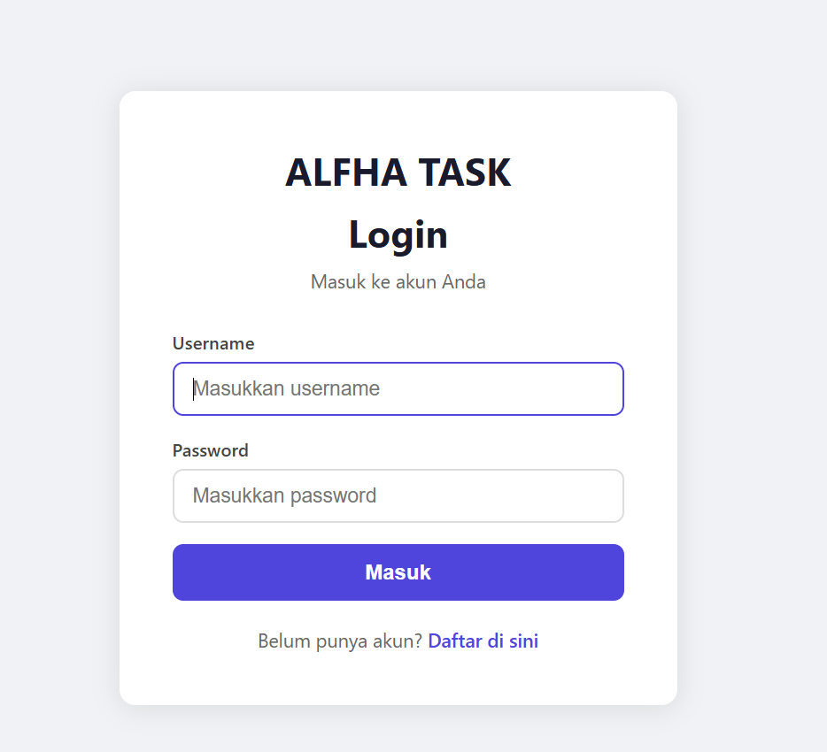
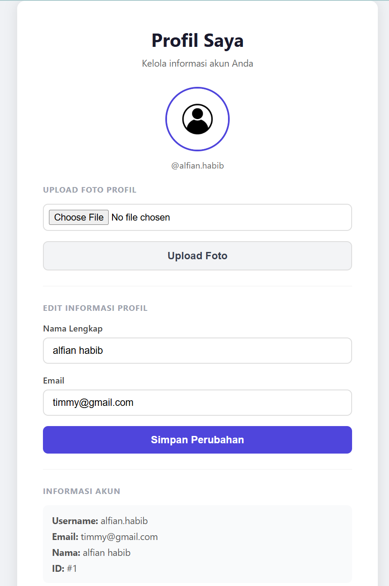
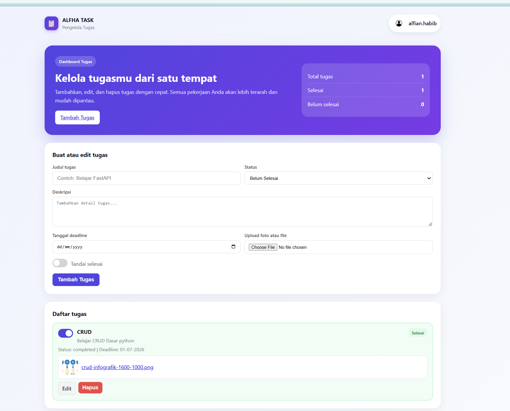

# 🚀 ALFHA TASK - Pengelola Tugas & Produktivitas
```
ALFHA TASK adalah aplikasi dashboard berbasis web komprehensif yang dirancang untuk membantu pengguna mengelola, melacak, dan mengorganisir tugas-tugas secara efisien. Dilengkapi dengan sistem autentikasi dan manajemen akun personal, setiap pengguna dapat memiliki ruang kerja pribadi yang aman dan terpusat.

```


🚀 Fitur Utama
Aplikasi ini kini dilengkapi dengan fitur-fitur mulai dari manajemen akun hingga operasional tugas harian (CRUD):


1. Sistem Autentikasi & Keamanan (New)
Pendaftaran Akun (Register): Pengguna baru dapat membuat akun dengan mengisi formulir Username, Email, Nama Lengkap (opsional), dan Password.

Masuk (Login): Akses aman ke dalam dashboard menggunakan kombinasi Username dan Password yang telah didaftarkan.


2. Manajemen Profil Pengguna (New)
Personalisasi Akun: Pengguna dapat mengunggah (upload) foto profil untuk menyesuaikan tampilan akun.

Pembaruan Data (Update Profile): Formulir untuk mengedit informasi profil kapan saja, seperti mengubah Nama Lengkap dan Email.

Informasi Akun: Menampilkan detail akun secara transparan, termasuk ID Pengguna, Username, Email, dan Nama.


3. Manajemen Tugas (CRUD)
Pembuatan Tugas (Create): Tambahkan tugas baru dengan detail seperti Judul, Status, Deskripsi, Tanggal Deadline, dan fitur unggah (upload) file/dokumen pendukung.

Daftar Tugas Interaktif (Read): Tampilan daftar tugas dalam bentuk kartu dengan indikator visual untuk status (Selesai/Belum Selesai), tenggat waktu, dan tautan lampiran file.

Pembaruan & Pelacakan (Update): Edit detail tugas yang sudah ada atau gunakan fitur toggle switch untuk menandai tugas selesai secara instan.

Penghapusan Tugas (Delete): Hapus tugas yang sudah tidak relevan dengan cepat.

Panel Statistik: Pantau produktivitas melalui ringkasan real-time yang menampilkan Total Tugas, Tugas Selesai, dan Tugas Belum Selesai.


